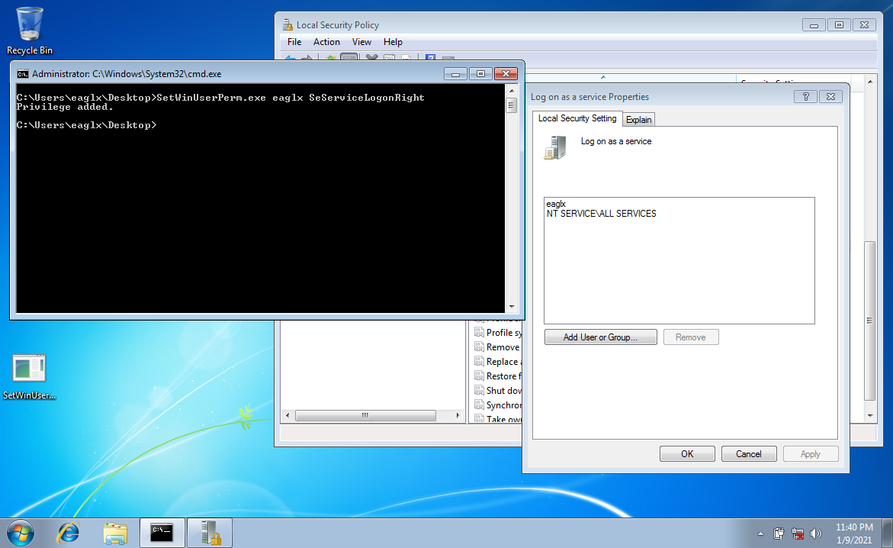

# SetWinUserPerm - a demo code
<i>Grant a user some permission programmatically</i>

More details can be found here:
* [Managing Account Permissions](https://docs.microsoft.com/pl-pl/windows/win32/secmgmt/managing-account-permissions?redirectedfrom=MSDN)
* [Translating Between Names and SIDs](https://docs.microsoft.com/pl-pl/windows/win32/secmgmt/translating-between-names-and-sids)
* [Account Rights Constants](https://docs.microsoft.com/en-us/windows/win32/secauthz/account-rights-constants)
* [Policy Object Access Rights](https://docs.microsoft.com/en-us/windows/win32/secmgmt/policy-object-access-rights)
